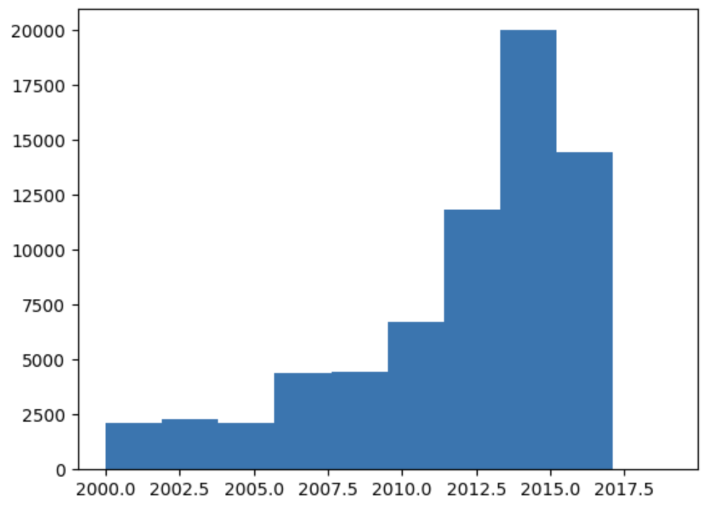
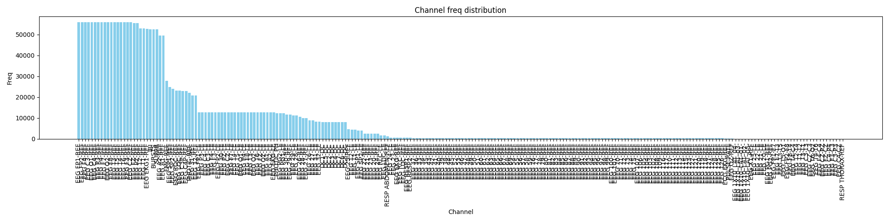
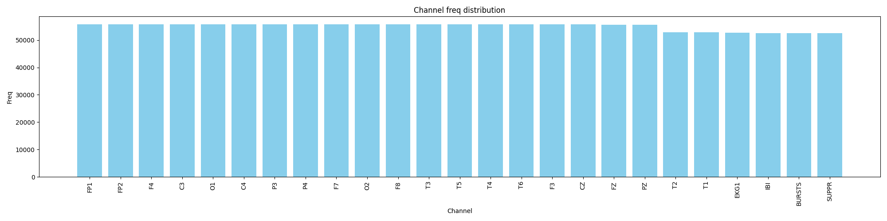

# TUH

## Задача и данные

Совместно с AIRI я провожу исследование по созданию Foundation модели для EEG данных (энцефалограммы мозга).
Первым этапом создания такой модели является создания квантизатора, который может сжимать данные в латентное пространство и восстанавливать их.
В качестве данных был выбран крупнейший доступный датасет EEG данных: [TUH](https://isip.piconepress.com/projects/tuh_eeg)

## Сбор данных

Этот датасет уже скачен на сервер, где стандартно проводитятся исследования (проект делается совместно университетом НИУ ВШЭ), необходимо определиться с препроцессингом данных для него.

## Предобработка

Для первоначального исследования было решено запустить на наших данных обучение модели [LaBraM](https://github.com/Deuqz/LaBraM/tree/main). Для этого написан файл для препроцессинга данных (dataset.py). Препроцессинг включает в себя: ресемплирование до 200 sample_rate, фильтрацию от 0.5 до 40 Hz, клиппинг до 5 стандартных отклонений. Этот препроцессинг обуславливается описанием преобработки из LaBraM и обсуждением с научным руководителем. А также разбиением на окна.

## Исследование

В TUH содержится информация только о дате исследования. Были проанализированы все данные и оказалось, что там были странные записи сделанные в 1899 году и записи в 2064 году. После их удаления время записи осталось с таким распределением:

Также были проанализированы каналы, которые содержатся в EEG данных. До филтрации было много ненужных каналов:

После фильтрации по THRESHHOLD=50000, остались следующие каналы:

Из препроцессинга были выкинуты каналы EKG1, IBI, BURSTS, SUPPR, т.к. они не соответствуют [используемому стандарту](https://github.com/Deuqz/LaBraM/blob/main/utils.py#L37).